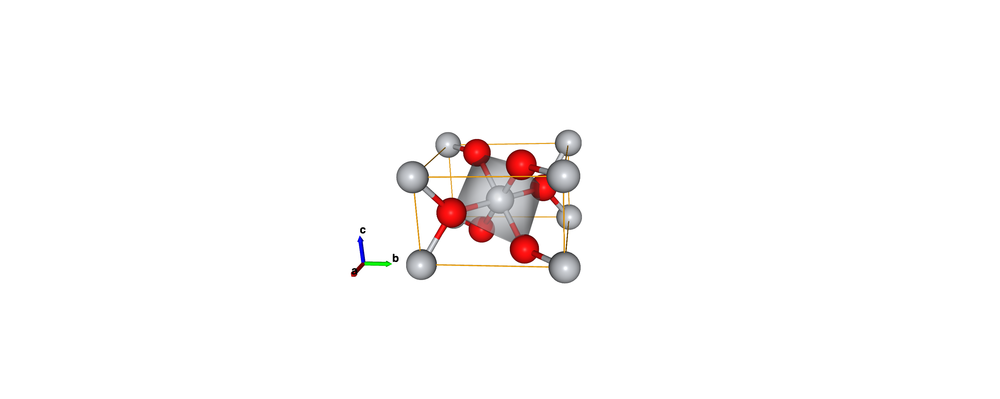
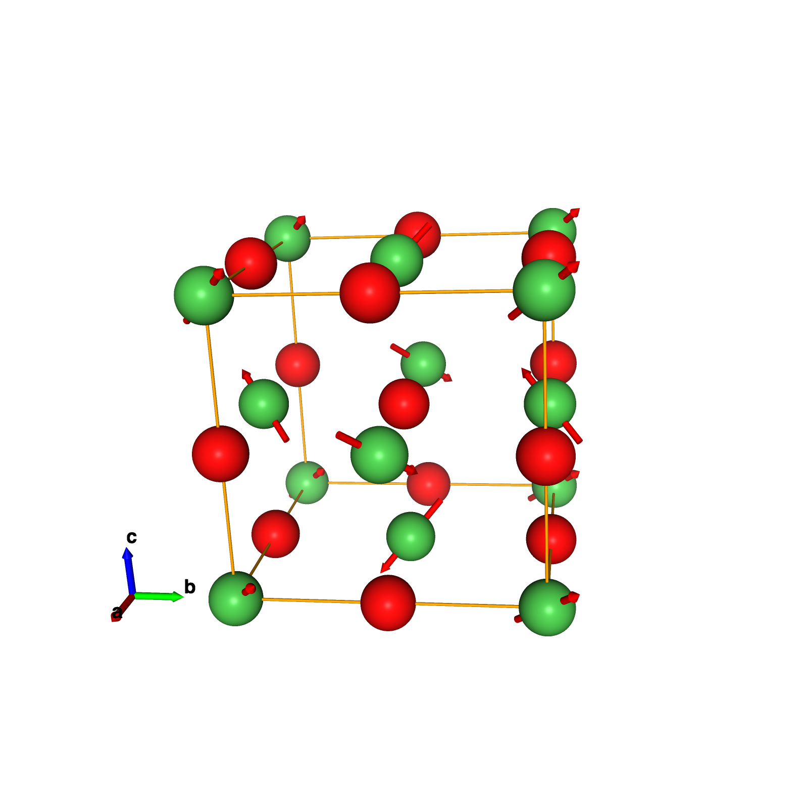
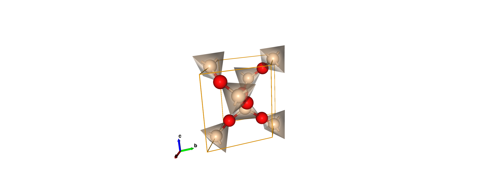

# nvc
nglview wrapper for crystal structure

## Gallery

<p>
    
    
    
</p>

## Installation

1. Install [nglview](https://github.com/nglviewer/nglview)

2. Install this package
```shell
git clone git@github.com:lan496/nvc.git
cd nvc
python -m pip install -r requirements.txt
python -m pip install .
```

## Example

See [examples/example.ipynb](examples/example.ipynb) for usage

```shell
from nvc import viewer
from pymatgen.core import Structure

structure = Structure.from_file('some_structure.cif')

view = viewer(structure)
view
```

## Developments

```shell
python -m pip install -r requirements.txt
python -m pip install -r requirements-dev.txt
python -m pip install -e .
```
